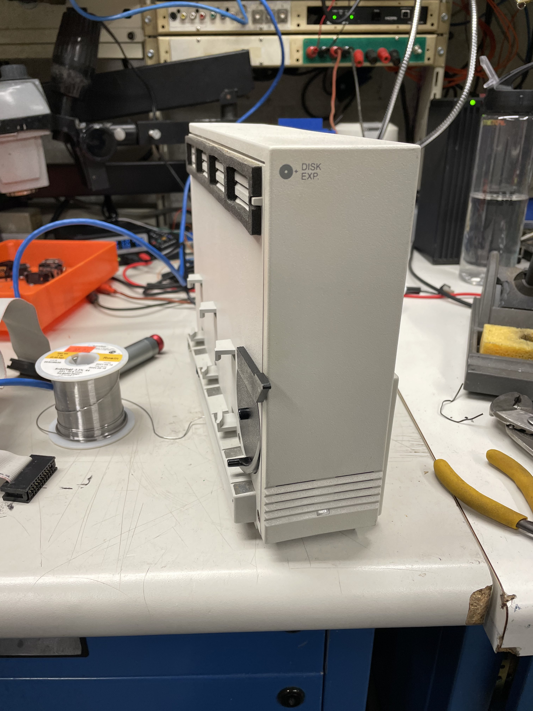
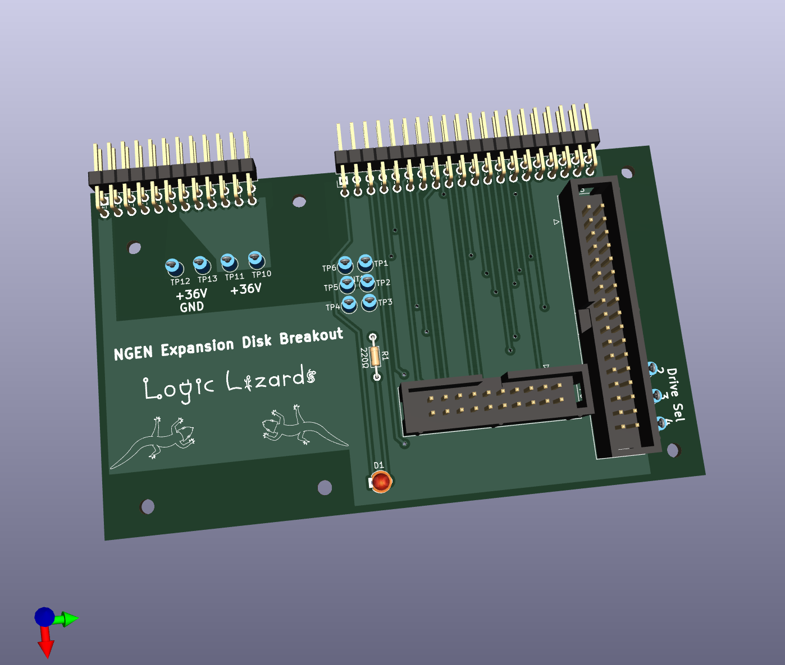

# NGEN Disk Expansion Breakout

Breakout for the NGEN Floppy disk and Hard disk controller to add a secondary external disk drive.

A photo of the expansion unit:

I reverse engineered it making a [Schematic](Schematic.pdf) which you can easily solder up on a perf board, or I laid out a simple board which you could order from a board house if you wish:

